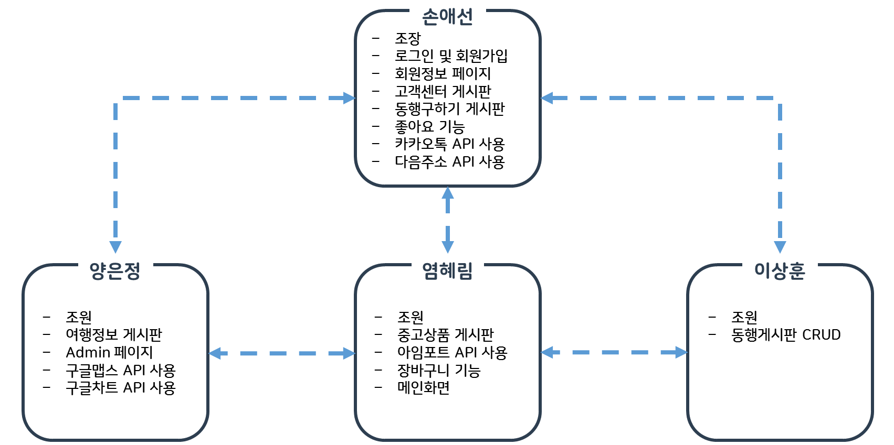
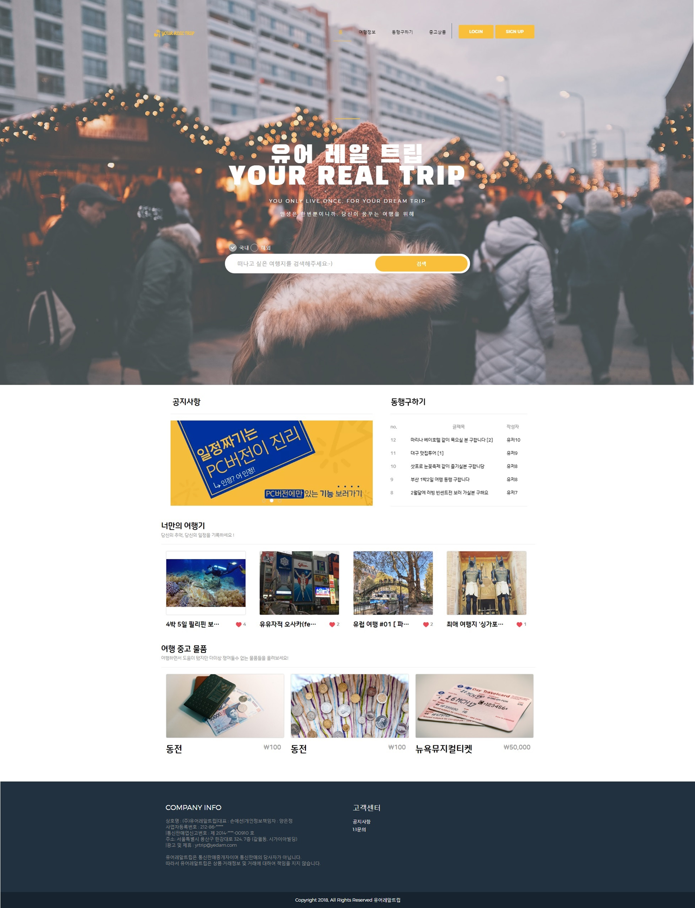

# 여행 정보 공유 시스템
##### - 여행정보 공유, 동행구하기 및 중고상품 거래를 중심으로
### 개요
- 본 개발 프로젝트는 웹 개발 언어인 Java, Javascript, JSP, JQuery를 기반으로 하고, 데이터베이스(DataBase)에 데이터 자료를 관리, 구조화하여 저장함으로써 자료 검색과 갱신의 효율을 높였다. 또한 Bootstrap을 활용한 UI(유저 인터페이스) 화면 구현 및 기술들을 접목시켜 여행정보 공유 시스템을 개발하였다.

### 주요기술
- Java 1.8.0, JSTL, JSP, Spring Framework, MyBatis(DB)
- HTML5, CSS3, Bootstrap 4, Javascript, jQuery
- Oracle 11g Express Edition, Apache Tomcat v8.5
- Eclipse, SQL Plus, SQL Developer
- Git(with SourceTree)

### 역할분담

### <a href="YRTrip/src/test/Screenshot">구현화면</a>
##### 메인

